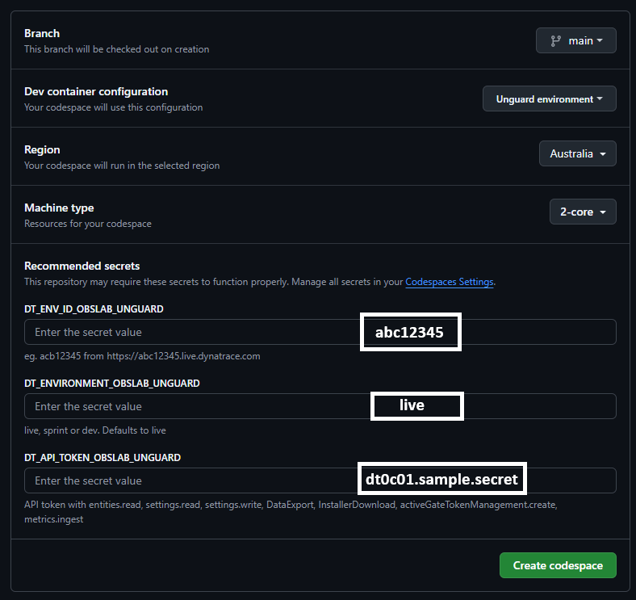

# Getting Started

!!! tip "Larger Images"
    To enlarge images, right click and open in new tab.

## Dynatrace Environment

You must have access to a Dynatrace SaaS environment. [Sign up here](https://dt-url.net/trial){target="_blank"}

Save the Dynatrace environment ID and environment

* The ID is the first portion of the URL. (eg. `acb12345` from `https://abc12345.live.dynatrace.com`)
* Your environment is probably `live` but could also be `sprint` or `dev`

## Create API Token

In Dynatrace:

* Press `ctrl + k`. Search for `access tokens`.
* Create a new access token with the following permissions:
    * `entities.read`
    * `settings.read`
    * `settings.write`
    * `DataExport`
    * `InstallerDownload`
    * `activeGateTokenManagement.create`
    * `metrics.ingest`

!!! info "API Token Permissions"
    These permissions are required to install the OneAgent in `applicationMode` and an ActiveGate on a Kubernetes cluster.

## Configure Dynatrace

The Dynatrace environment needs to be configured to automatically block incoming attacks.

### Enable OneAgent Features

In Dynatrace:

* Press `ctrl + k`. Search for `settings`
* Go to `Preferences > OneAgent features`
* Search for `code level`
* Enable all the features (some require the instrumentation to be added in the details as well)

### Enable Vulnerability Analytics

* Go to `Application Security > Application Security`
* Now go to `Vulnerability Analytics > General Settings`
* Turn on the `Enable Third-party Vulnerability Analytics` toggle and ensure all languages are checked
* Switch to the `Code-level Vulnerability Analytics` tab
* Turn on the `Enable Code-level Vulnerability Analytics toggle

### Enable Runtime Application Protection

* Go to `Application Security > Application Protection > General Settings`
* Turn on the `Enable Runtime Application Protection` toggle
* Ensure that `Attack Control Java` is set to `Block; incoming attacks detected and blocked.`
* Ensure that `Attack Control .NET` is also set to `Block; incoming attacks detected and blocked.`

## Start Demo

--8<-- "snippets/codespace-details-warning-box.md"

You've done the hard work! It is time to spin up the demo environment.

Click this button to open the demo environment. This will open in a new tab.

{target="_blank"}

* Fill in the form with the details you've already gathered.
* Click `Create codespace`
* Proceed to the next documentation step with the link below.

- [Click Here to Continue :octicons-arrow-right-24:](installation-explained.md)

