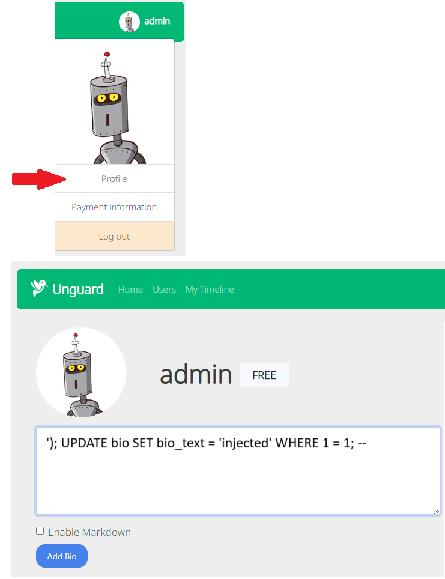
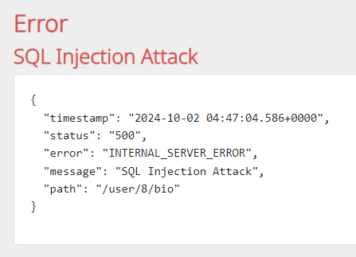
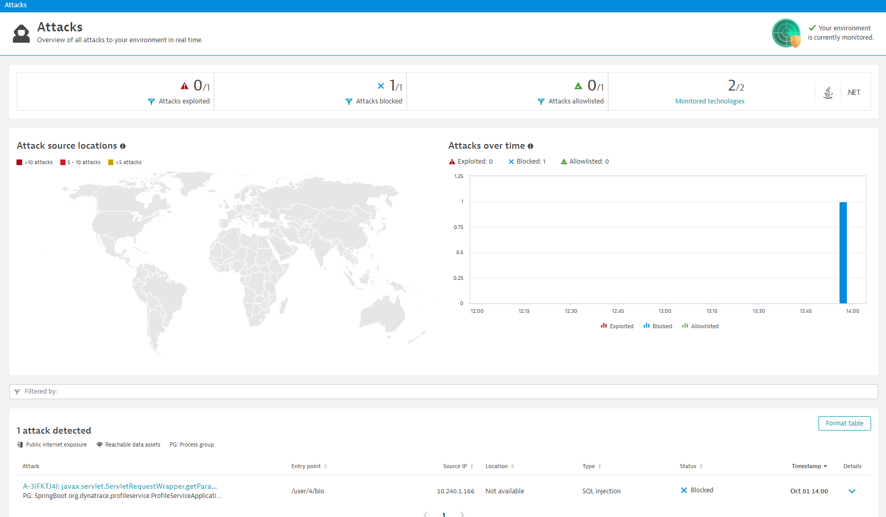

# SQL Injection

Unguard has an SQL injection vulnerability in the `profile-service`. You can exploit this via the `User profile` setting.

Let's attempt that now.

# Exploitation

To inject an SQL command, you simply need to log into Unguard, go to your profile page and insert a bio using the following text. This will set the text of all users (where their bio is currently unset) to `injected`:



!!! info "If the button says `Add Bio`"

    ```
    ' WHERE 0 = 1; UPDATE bio SET bio_text = 'injected' WHERE 1 = 1; --
    ```

!!! info "If the button says `Update Bio`"

    ```
    ' WHERE 0 = 1; UPDATE bio SET bio_text = 'injected' WHERE 1 = 1; --
    ```
    In this case, the beginning has to be slightly different to accommodate the syntax of the ```INSERT INTO``` statement.

## Result: SQL Injection Blocked

!!! success
    Dynatrace OneAgent has successfully blocked the SQL injection attack!

To verify that it really has been blocked:

* Click `Home`
* Go back to your profile
* You should still see the empty box and `Add bio` text



## Validate in Dynatrace

Let's see how Dynatrace visualises these attack attempts.

In Dynatrace:

* Press `ctrl + k`. Search for `attacks`

!!! tip "Enlarge Images"
    Remember, right click and "open in a new tab"
    to enlarge images

You should see `1/1 Attacks blocked` and `0/1 Attacks exploited`.



## View Attack Attempt Details

Scroll down to the section titled `1 attack detected` and follow the link to see the details of this attack.

Dynatrace provides all the relevant information such as:

* A unique ID for this attack attempt so tracking is easier
* The entrypoint (a user bio page)
* The SQL statement (actual injection attempt)
* The vulnerable line of code and function


!!! success "SQL Injection Prevented"
    🎉 Dynatrace OneAgent has prevented an SQL injection attack on your infrastructure.

!!! question "What's Next?"
    Feel free to follow some of the other exploit tutorials or if you're finished, head to the [cleanup page](../cleanup.md) to cleanup your demo environment.